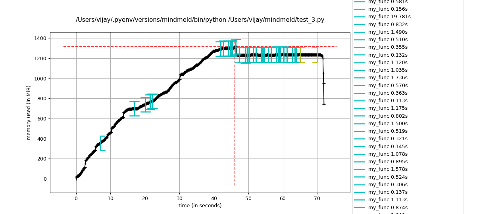
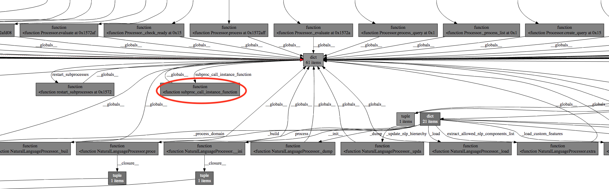
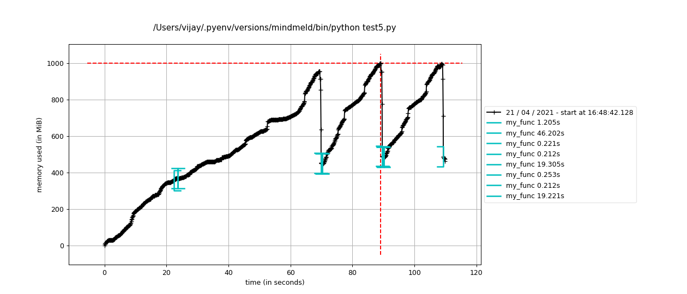

## Problem

We were loading multiple [MindMeld](https://github.com/cisco/mindmeld) python applications on the same server to serve multiple client bots. We then found that after awhile, our servers were running out of memory. MindMeld applications run on CPU (as compared to GPUs for most ML platforms) due to our model types.

Since we weren't loading any large objects apart from the MindMeld applications into memory, we had a suspicion that the MindMeld applications had a memory leak. Additionally, we knew that a service hosting a single MindMeld application did not run out of memory, so the act of loading multiple MindMeld applications caused the memory leak.

## Validating the memory leak using memory_profiler

We first crafted a concise code block that could reproduce the memory leak. We focused on loading multiple MindMeld bots in sequence since that seemed to cause the spikes in memory. Some of the bots where large while others were small. We used [memory_profiler](https://github.com/pythonprofilers/memory_profiler) to profile the memory for the `my_func` function.

```python
from memory_profiler import profile
from mindmeld.app_manager import ApplicationManager


@profile
def my_func(app_name):
    temp_manager = ApplicationManager(app_name)
    temp_manager.nlp.load()


if __name__ == '__main__':
    app_1 = 'kwik_e_mart'
    app_2 = 'video_discovery'
    ...
    my_func(app_1)
    my_func(app_2)
    ...
```

We then plotted the memory profile of the script over time using these commands:
```bash
mprof run test.py
mprof plot
```


We saw that memory was increasing linearly as `my_func` was called repeatedly. If there were no leaks, the memory profile would be constant over time since the python objects into `my_func` should be released and garbage collected after the function is de-scoped.

## Finding mem-leak hotspots in the codebase using Objgraph & sys.getrefcount

Since we knew a lot about the MindMeld codebase, we suspected that the [resource loader](https://github.com/cisco/mindmeld/blob/master/mindmeld/resource_loader.py), which holds a lot of objects in memory was not being released. To test that this object was not being released, we crafted the code block:

```python
import sys
import gc
from mindmeld.app_manager import ApplicationManager


def my_func(app_name):
    temp_manager = ApplicationManager(app_name)
    temp_manager.nlp.load()
    # Count refs to the resource_loader
    print(f"before release: {int(sys.getrefcount(temp_manager.nlp.resource_loader))}")
    ref_to_resource_loader = temp_manager.nlp.resource_loader
    del temp_manager
    gc.collect()
    # Count refs to the resource_loader after deleting the main ref
    print(f"after release: {int(sys.getrefcount(ref_to_resource_loader))}")


if __name__ == '__main__':
    app_1 = 'kwik_e_mart'
    app_2 = 'video_discovery'
    ...
    my_func(app_1)
    my_func(app_2)
    ...
```

```bash
python test.py

>>> before release: 27
>>> after release: 27
>>> before release: 62
>>> after release: 62
```

As we see, even after deleting the reference to the object that contains the `resource_loader` and commanding the `gc` to clear memory, the reference count to the `resource_loader` has not decremented. Ideally, we should see it decrement to `2`, one for the current `ref_to_resource_loader` and the other for `sys.getrefcount`'s argument variable.

Even though we knew that the `resource_loader` object was not being released, it still wasn't unclear what action we could take to fix this since any of the 27 to 62 references to the `resource_loader` could not be releasing. How do find this "needle" reference in the haystack?

[Objgraph](https://mg.pov.lt/objgraph/) provides beautiful visualizations of the chain of references to any python object. Since we know one object that is not being released, we can then visualize all the references to that object and see which one of those references could be the culprit.

```python
def my_func(app_name):
    temp_manager = ApplicationManager(app_name)
    temp_manager.nlp.load()
    # Count refs to the resource_loader
    print(f"before release: {int(sys.getrefcount(temp_manager.nlp.resource_loader))}")
    ref_to_resource_loader = temp_manager.nlp.resource_loader
    del temp_manager
    gc.collect()
    objgraph.show_backrefs([ref_to_resource_loader], too_many=50, max_depth=10)
    # Count refs to the resource_loader after deleting the main ref
    print(f"after release: {int(sys.getrefcount(ref_to_resource_loader))}")
```

Note: It is important to set `too_many` and `max_depth` appropriately large to visualize the entire chain of references since we found that our issue reference was hidden when the default settings were used. 



Using Objgraph's visualization, we found a section in the [entire visualization](https://raw.githubusercontent.com/vijay120/vijay120.github.io/master/images/backtrace_viz.svg) where a `dict` object had many references from `__globals__` pointing to it. This `dict` was in-turn chained to the `resource_loader`. Such references from `__globals__` indicate that there are global references to an object in the MindMeld codebase even though we explicitly de-scoped the variables referring to MindMeld objects. This is definitely a memory leak.


Upon inspection of `subproc_call_instance_function` which references the dictionary that has global references, we found the problem object: `Processor.instance_map`.


```python
def subproc_call_instance_function(instance_id, func_name, *args, **kwargs):
    try:
        instance = Processor.instance_map[instance_id]
        return getattr(instance, func_name)(*args, **kwargs)
    except Exception:
        sys.exit(1)

class Processor(ABC):
    instance_map = {}
    ...

    def __init__(self, ...):
    	...
    	Processor.instance_map[id(self)] = self
```


`Processor.instance_map` is a static map whose values are references to instance `Processor` objects. This static map will remain in memory even if `Processor` objects are de-referenced and since it itself references these `Processor` objects, the `Processor` objects will not be de-referenced as well due to the static map's reference. And since `Processor` objects contain `resource_loader` objects, no wonder `resource_loader` objects are persisting across multiple MindMeld applications, leading to out-of-memory issues.


## Fixing mem leaks using Weak Referencing

We found that the mem leak is caused by a static map having "strong" references to its `Processor` object values. To solve this problem, we used python's [WeakValueDictionary](https://docs.python.org/3/library/weakref.html#weakref.WeakValueDictionary), which references values weakly, so its values will be discarded when no strong reference to the values exists any more. If the instance map is the only reference to the `Processor` objects, the objects will be discarded.

Note: Read [this](https://docs.python.org/3/library/weakref.html) for a detailed explanation of weak vs strong references in python.

```python
class Processor(ABC):
    instance_map = WeakValueDictionary()
    ...

    def __init__(self, ...):
    	...
    	Processor.instance_map[id(self)] = self
```

Now, when running the `getrefcount` code block, we see that the number of references are getting decremented to `2` after deleting the main MindMeld reference and garbage collecting:

```bash
python test.py

>>> before release: 27
>>> after release: 2
>>> before release: 62
>>> after release: 2
```


The memory profile plot shows that memory is being released after each function call as expected.


### Conclusion

Using `memory_profiler` to chart the memory profile of a program over time and `Objgraph` to visualize object referencing, we can identify specific data structures that are not being released. We can then use `WeakValueDictionary` or `WeakKeyDictionary` to create weak reference maps that can release memory appropriately. [This](https://github.com/cisco/mindmeld/pull/296) is the actual pull request fix.

